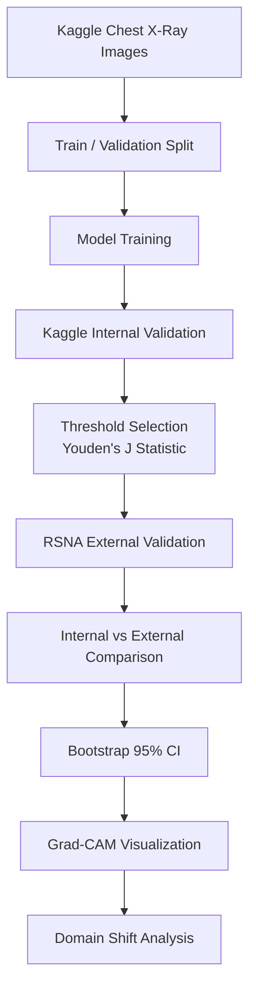

# 🫁 aip_project

<div align="center">

# Pneumonia Classification & Domain Shift Analysis

### Chest X-ray 기반 폐렴 분류 AI 모델 개발  
### Kaggle 내부 검증과 RSNA 외부 검증을 통한 Domain Shift 분석

<br>


<br>

> **Kaggle 내부 validation에서 잘 작동하는 폐렴 분류 모델은  
> RSNA 외부 데이터셋에서도 같은 수준으로 작동할까?**

</div>

---

## 📌 Project Summary

`aip_project`는 흉부 X-ray 이미지를 이용해 **정상(Normal)** 과 **폐렴(Pneumonia)** 을 분류하는 의료 AI 프로젝트입니다.

이 프로젝트의 핵심은 단순히 내부 validation accuracy를 높이는 것이 아닙니다.  
진짜 목표는 **Kaggle Chest X-Ray Images 데이터셋에서 학습한 모델을 RSNA Pneumonia Detection Challenge 데이터셋에서 외부 검증하고, 내부 성능과 외부 성능의 차이를 통해 Domain Shift를 분석하는 것**입니다.

의료 AI 모델은 하나의 데이터셋에서는 높은 성능을 보여도, 실제 다른 병원·촬영 장비·환자군·라벨링 기준이 적용된 데이터에서는 성능이 크게 흔들릴 수 있습니다.  
본 프로젝트는 이 문제를 **고정 threshold**, **외부 검증**, **Bootstrap Confidence Interval**, **Grad-CAM** 기반으로 분석하는 것을 목표로 합니다.

---

## 🎯 Main Objective

본 프로젝트는 다음 질문에 답하는 것을 목표로 합니다.

```text
Kaggle Chest X-Ray Images 데이터셋으로 학습한 폐렴 분류 모델이
RSNA Pneumonia Detection Challenge 데이터셋에서도
동일하게 신뢰할 수 있는 성능을 보이는가?
```

이를 위해 다음 원칙을 유지합니다.

| Principle | Description |
|---|---|
| Kaggle 학습 | Kaggle Chest X-Ray Images 데이터셋만 학습에 사용 |
| RSNA 외부 검증 | RSNA는 학습에 사용하지 않고 external validation에만 사용 |
| Threshold 고정 | Kaggle validation에서 결정한 threshold를 RSNA에 그대로 적용 |
| Domain Shift 분석 | Internal 성능과 External 성능 차이를 정량적으로 비교 |
| Explainability | Grad-CAM으로 모델이 실제 폐 영역을 보는지 확인 |

---

## 🧠 Core Idea

<div align="center">

| 일반적인 폐렴 분류 프로젝트 | aip_project |
|---|---|
| 내부 validation accuracy 중심 | 내부 성능과 외부 성능 차이 비교 |
| 단일 데이터셋 성능 보고 | Kaggle → RSNA 외부 검증 |
| threshold를 데이터셋마다 조정 | 내부 threshold를 외부에 고정 적용 |
| 점수만 보고 종료 | Bootstrap CI와 Grad-CAM으로 분석 |
| 모델 성능 자체에 집중 | Domain Shift 발생 여부에 집중 |

</div>

---

## 🔬 Why Domain Shift?

의료 영상 데이터는 병원, 촬영 장비, 환자군, 라벨링 기준, 전처리 방식에 따라 분포가 달라질 수 있습니다.

따라서 하나의 데이터셋에서 높은 성능을 보인 모델이라도,  
다른 데이터셋에서는 성능이 크게 하락할 수 있습니다.

본 프로젝트에서는 다음 구조로 Domain Shift를 확인합니다.

```text
Train Dataset       : Kaggle Chest X-Ray Images
Internal Validation : Kaggle validation split
External Validation : RSNA Pneumonia Detection Challenge
```

핵심은 **RSNA 데이터셋을 학습과 threshold 튜닝에 사용하지 않는 것**입니다.  
RSNA는 오직 외부 검증 단계에서만 사용합니다.

---

## 🗂 Dataset

## 1. Kaggle Chest X-Ray Images

학습 및 내부 검증에 사용하는 데이터셋입니다.

| Item | Description |
|---|---|
| Dataset | Chest X-Ray Images (Pneumonia) |
| Source | Kaggle |
| Format | JPEG |
| Task | Normal vs Pneumonia binary classification |
| Usage | Training / Internal validation |
| Local Path | `/local_datasets/daniel3290/chest_xray_kaggle/chest_xray` |

```text
Kaggle Chest X-Ray Images
├── train/
│   ├── NORMAL
│   └── PNEUMONIA
├── val/
└── test/
```

원본 validation set은 이미지 수가 매우 적기 때문에,  
본 프로젝트에서는 Kaggle train 데이터를 자체적으로 train / validation으로 다시 분할합니다.

현재 split 결과는 다음과 같습니다.

| Split | NORMAL | PNEUMONIA | Total |
|---|---:|---:|---:|
| Train | 1,073 | 3,092 | 4,165 |
| Validation | 268 | 783 | 1,051 |
| Total | 1,341 | 3,875 | 5,216 |

---

## 2. RSNA Pneumonia Detection Challenge

외부 검증에 사용하는 데이터셋입니다.

| Item | Description |
|---|---|
| Dataset | RSNA Pneumonia Detection Challenge |
| Source | Kaggle Competition |
| Format | DICOM |
| Task | Pneumonia detection |
| Usage | External validation only |
| Local Path | `/local_datasets/daniel3290/rsna` |

```text
RSNA Pneumonia Detection Challenge
├── stage_2_train_images/
├── stage_2_train_labels.csv
└── stage_2_detailed_class_info.csv
```

RSNA 데이터셋은 모델 학습이나 threshold 튜닝에 사용하지 않습니다.  
외부 환경에서 모델이 얼마나 일반화되는지 확인하기 위한 검증 데이터로만 사용합니다.

현재 외부 검증은 계산 자원을 고려하여 다음 설정으로 수행했습니다.

| Class | Samples |
|---|---:|
| Normal | 1,000 |
| Pneumonia | 1,000 |
| Total | 2,000 |

---

## 🧭 Project Pipeline



---

## 🏗 Model Architecture

본 프로젝트는 Baseline CNN으로 전체 파이프라인을 먼저 검증한 뒤, ResNet50과 TorchXRayVision 기반 모델로 확장했습니다.

| Model | Description | Purpose | Status |
|---|---|---|---|
| Baseline CNN | 직접 설계한 단순 CNN | 최소 기준 성능 확인 | ✅ Done |
| ResNet50 | `timm` 기반 ImageNet pretrained ResNet50 | 전이학습 기반 성능 개선 | ✅ Done |
| TorchXRayVision DenseNet121 | `densenet121-res224-chex` weight 사용 | 흉부 X-ray 도메인 사전학습 모델 비교 | ✅ Done |

TorchXRayVision 실험에서는 RSNA 또는 all weight를 사용하지 않고, `densenet121-res224-chex` weight를 사용했습니다.  
이는 외부 검증 데이터셋인 RSNA가 사전학습에 섞이는 문제를 피하기 위한 선택입니다.

---

## 📊 Evaluation Metrics

폐렴 분류 문제에서는 단순 Accuracy만으로 모델을 평가하기 어렵습니다.

특히 폐렴 환자를 정상으로 잘못 분류하는 **False Negative**를 줄이는 것이 중요하기 때문에,  
Recall, F1-score, AUC를 함께 확인합니다.

| Metric | Meaning |
|---|---|
| Accuracy | 전체 예측 중 맞춘 비율 |
| Precision | 폐렴으로 예측한 것 중 실제 폐렴 비율 |
| Recall | 실제 폐렴을 놓치지 않고 잡아낸 비율 |
| F1-score | Precision과 Recall의 균형 |
| AUC-ROC | threshold 변화에 따른 전체 분류 성능 |
| Bootstrap 95% CI | 성능 추정치의 신뢰구간 |

---

## 🎚 Threshold Policy

본 프로젝트에서는 외부 검증에서 threshold를 다시 최적화하지 않습니다.

내부 validation set에서 ROC curve를 만든 뒤,  
**Youden's J statistic**을 이용해 threshold를 결정합니다.

```text
Youden's J = Sensitivity + Specificity - 1
```

그 다음 이 threshold를 RSNA 외부 검증에 그대로 적용합니다.

```text
Kaggle Internal Validation에서 threshold 결정
                  ↓
RSNA External Validation에 동일 threshold 적용
                  ↓
외부 데이터셋에서 성능 하락 여부 확인
```

이 방식은 외부 데이터셋에 맞춰 모델을 유리하게 조정하지 않기 때문에,  
Domain Shift를 더 공정하게 분석할 수 있습니다.

---

## 📈 Current Experimental Results

현재까지 seed 42 기준으로 Baseline CNN, ResNet50, TorchXRayVision 모델의 학습 및 RSNA 외부 검증을 완료했습니다.

## 1. Internal Validation Results

| Model | Accuracy | Precision | Recall | F1-score | AUC |
|---|---:|---:|---:|---:|---:|
| Baseline CNN | 0.9115 | 0.9612 | 0.9183 | 0.9393 | 0.9613 |
| ResNet50 | 0.9810 | 0.9923 | 0.9821 | 0.9872 | 0.9983 |
| TorchXRayVision | 0.9762 | 0.9871 | 0.9808 | 0.9840 | 0.9968 |

---

## 2. RSNA External Validation Results

RSNA external validation은 각 클래스 1,000장씩 총 2,000장 기준으로 수행했습니다.

| Model | Threshold | Accuracy | Precision | Recall | F1-score | AUC |
|---|---:|---:|---:|---:|---:|---:|
| Baseline CNN | 0.5721 | 0.5095 | 0.5049 | 0.9700 | 0.6642 | 0.6402 |
| ResNet50 | 0.2040 | 0.6165 | 0.5683 | 0.9690 | 0.7165 | 0.7710 |
| TorchXRayVision | 0.5366 | 0.6820 | 0.6204 | 0.9380 | 0.7468 | 0.7833 |

---

## 3. Domain Shift Observation

세 모델 모두 Kaggle 내부 validation에서는 높은 AUC를 보였지만, RSNA 외부 검증에서는 AUC가 크게 하락했습니다.

```text
Baseline CNN
Internal AUC : 0.9613
External AUC : 0.6402
AUC Drop     : -0.3211

ResNet50
Internal AUC : 0.9983
External AUC : 0.7710
AUC Drop     : -0.2273

TorchXRayVision
Internal AUC : 0.9968
External AUC : 0.7833
AUC Drop     : -0.2135
```

TorchXRayVision 모델이 external AUC와 F1-score 기준으로 가장 좋은 외부 성능을 보였지만,  
internal 성능 대비 external 성능이 여전히 크게 낮아져 Domain Shift가 확인되었습니다.

---

## 📈 Bootstrap Confidence Interval

단일 성능 점수만으로는 모델을 충분히 평가하기 어렵습니다.

따라서 다음 단계에서는 internal validation과 external validation 각각에 대해 Bootstrap resampling을 수행하고 95% Confidence Interval을 계산할 예정입니다.

```text
Internal AUC  : point estimate + 95% CI
External AUC  : point estimate + 95% CI

Internal F1   : point estimate + 95% CI
External F1   : point estimate + 95% CI
```

이를 통해 내부 성능과 외부 성능의 차이가 단순한 우연인지,  
의미 있는 성능 저하인지 확인합니다.

---

## 🔥 Grad-CAM Analysis

Grad-CAM은 모델이 X-ray 이미지의 어느 영역을 보고 판단했는지 확인하기 위해 사용합니다.

본 프로젝트에서는 Grad-CAM을 단순 시각화가 아니라  
Domain Shift 해석 자료로 활용합니다.

확인할 내용은 다음과 같습니다.

| Checkpoint | Analysis Point |
|---|---|
| True Positive | 폐렴 영역을 제대로 보고 맞춘 사례 |
| False Negative | 실제 폐렴인데 정상으로 놓친 사례 |
| Kaggle vs RSNA | 데이터셋별 모델 주목 영역 차이 |
| Background Reliance | 이미지 외곽, 텍스트, 병원 마커 의존 여부 |

---

## 🛠 Tech Stack

<div align="center">

| Category | Stack |
|---|---|
| Language | Python |
| Deep Learning | PyTorch |
| Model Library | timm, TorchXRayVision |
| Image Processing | OpenCV, PIL |
| Medical Image Processing | pydicom |
| Data Analysis | pandas, numpy |
| Evaluation | scikit-learn |
| Visualization | matplotlib, Grad-CAM |
| Experiment Environment | KHU SERAPH GPU Cluster |
| Scheduler | Slurm, sbatch |
| Version Control | Git, GitHub |

</div>

---

## 📁 Repository Structure

```text
aip_project/
├── README.md
├── .gitignore
├── docs/
│   └── proposal.md
├── src/
│   ├── dataset.py
│   ├── prepare_kaggle_split.py
│   ├── train_baseline.py
│   ├── train_resnet50.py
│   ├── train_torchxrayvision.py
│   ├── evaluate_baseline_external.py
│   ├── evaluate_resnet50_external.py
│   ├── evaluate_torchxrayvision_external.py
│   ├── rsna_dataset.py
│   └── models/
│       ├── baseline_cnn.py
│       └── resnet50.py
├── scripts/
│   └── *.sbatch
└── outputs/
    ├── splits/
    ├── baseline/
    ├── baseline_external/
    ├── resnet50/
    ├── resnet50_external/
    ├── torchxrayvision/
    └── torchxrayvision_external/
```

> `outputs/`, dataset files, model checkpoints are not committed to GitHub.

---

## 🖥 Experiment Environment

본 프로젝트는 KHU SERAPH GPU Cluster의 moana 클러스터에서 실행합니다.

SERAPH에서는 마스터 노드에서 무거운 작업을 실행하지 않고,  
`srun` 또는 `sbatch`를 통해 컴퓨트 노드에서 학습과 평가를 수행합니다.

```text
Repository path
/data/daniel3290/repos/aip_project

Dataset archive path
/data/daniel3290/datasets/tarfiles

Training dataset path
/local_datasets/daniel3290
```

DataLoader는 `/data`를 직접 읽지 않고,  
컴퓨트 노드의 `/local_datasets/daniel3290` 경로를 기준으로 데이터를 로드합니다.

---

## 🚀 How to Run

아래 명령어는 **SERAPH srun 컴퓨트 노드**에서 실행하는 기준입니다.

```bash
cd /data/daniel3290/repos/aip_project
conda activate aip_project
```

---

## 1. Prepare Kaggle Split

```bash
python src/prepare_kaggle_split.py \
  --data_root /local_datasets/daniel3290/chest_xray_kaggle/chest_xray \
  --output_csv outputs/splits/kaggle_split_seed42.csv \
  --seed 42
```

---

## 2. Train Baseline CNN

```bash
python src/train_baseline.py \
  --split_csv outputs/splits/kaggle_split_seed42.csv \
  --data_root /local_datasets/daniel3290/chest_xray_kaggle/chest_xray \
  --output_dir outputs/baseline \
  --seed 42 \
  --epochs 5
```

---

## 3. Evaluate Baseline CNN on RSNA

```bash
python src/evaluate_baseline_external.py \
  --checkpoint outputs/baseline/best_baseline_seed42.pt \
  --split_csv outputs/splits/kaggle_split_seed42.csv \
  --rsna_root /local_datasets/daniel3290/rsna \
  --output_dir outputs/baseline_external \
  --sample_per_class 1000 \
  --seed 42
```

---

## 4. Train ResNet50

```bash
python src/train_resnet50.py \
  --split_csv outputs/splits/kaggle_split_seed42.csv \
  --data_root /local_datasets/daniel3290/chest_xray_kaggle/chest_xray \
  --output_dir outputs/resnet50 \
  --seed 42 \
  --epochs 10 \
  --batch_size 32 \
  --lr 1e-4
```

---

## 5. Evaluate ResNet50 on RSNA

```bash
python src/evaluate_resnet50_external.py \
  --checkpoint outputs/resnet50/best_resnet50_seed42.pt \
  --split_csv outputs/splits/kaggle_split_seed42.csv \
  --rsna_root /local_datasets/daniel3290/rsna \
  --output_dir outputs/resnet50_external \
  --sample_per_class 1000 \
  --seed 42
```

---

## 6. Train TorchXRayVision Model

```bash
python src/train_torchxrayvision.py \
  --split_csv outputs/splits/kaggle_split_seed42.csv \
  --data_root /local_datasets/daniel3290/chest_xray_kaggle/chest_xray \
  --output_dir outputs/torchxrayvision \
  --seed 42 \
  --epochs 10 \
  --batch_size 32 \
  --lr 1e-4
```

---

## 7. Evaluate TorchXRayVision Model on RSNA

```bash
python src/evaluate_torchxrayvision_external.py \
  --checkpoint outputs/torchxrayvision/best_torchxrayvision_seed42.pt \
  --split_csv outputs/splits/kaggle_split_seed42.csv \
  --rsna_root /local_datasets/daniel3290/rsna \
  --output_dir outputs/torchxrayvision_external \
  --sample_per_class 1000 \
  --seed 42
```

---

## 📌 Current Progress

현재까지 구현 및 검증된 내용입니다.

- Kaggle Chest X-Ray Images 데이터셋 다운로드 완료
- RSNA Pneumonia Detection Challenge 데이터셋 다운로드 완료
- SERAPH 컴퓨트 노드에서 데이터셋 압축 해제 완료
- Kaggle train 데이터 기반 train / validation split 생성 완료
- Baseline CNN 학습 및 RSNA external validation 완료
- ResNet50 전이학습 및 RSNA external validation 완료
- TorchXRayVision 후보 모델 학습 및 RSNA external validation 완료
- Kaggle validation에서 Youden's J statistic으로 threshold 계산 완료
- 내부 validation threshold를 RSNA 외부 검증에 고정 적용 완료
- Internal AUC와 External AUC 사이의 성능 하락 확인
- Baseline CNN → ResNet50 → TorchXRayVision 순으로 external 성능 개선 확인

---

## 🧪 Key Result

현재 가장 좋은 외부 검증 성능은 TorchXRayVision 모델에서 확인되었습니다.

```text
Best External Model : TorchXRayVision densenet121-res224-chex

Internal AUC        : 0.9968
External AUC        : 0.7833
External F1-score   : 0.7468
External Recall     : 0.9380
```

다만 internal AUC 0.9968에서 external AUC 0.7833으로 하락했기 때문에,  
의료 영상 데이터셋 간 Domain Shift가 여전히 존재함을 확인할 수 있습니다.

---

## ✅ To-Do

- [x] Kaggle dataset download
- [x] RSNA dataset download
- [x] Kaggle train / validation split
- [x] Baseline CNN training
- [x] Baseline CNN RSNA external validation
- [x] ResNet50 transfer learning
- [x] ResNet50 RSNA external validation
- [x] TorchXRayVision candidate model training
- [x] TorchXRayVision RSNA external validation
- [ ] 3 random seed experiments
- [ ] Bootstrap 95% Confidence Interval
- [ ] Grad-CAM visualization
- [ ] Final domain shift analysis report

---

## 🧩 Expected Outputs

| Output | Description |
|---|---|
| Split CSV | Kaggle train / validation split 정보 |
| Model Checkpoint | 학습된 모델 가중치 |
| Internal Metrics | Kaggle validation 성능 결과 |
| External Metrics | RSNA validation 성능 결과 |
| Prediction CSV | RSNA prediction 결과 |
| Bootstrap Report | AUC, F1-score의 95% CI |
| Grad-CAM Figures | 모델 판단 근거 시각화 |
| Domain Shift Report | 내부/외부 성능 차이 분석 |

---

## ⚠️ Notes

본 프로젝트는 의료 진단을 직접 대체하기 위한 목적이 아닙니다.

이 프로젝트는 공개 데이터셋 기반의 의료 영상 분류 모델을 구현하고,  
외부 검증을 통해 의료 AI 모델의 일반화 성능과 Domain Shift 문제를 분석하기 위한 연구 및 교육 목적의 프로젝트입니다.

또한 RSNA 데이터셋은 학습이나 threshold 최적화에 사용하지 않고,  
외부 검증에만 사용합니다.

---

## ⭐ Key Message

<div align="center">

### This project is not only about building a pneumonia classifier.

<br>

### It is about asking whether a model that performs well internally  
### can still be trusted under an external data distribution.

<br>

### Kaggle → RSNA  
### Internal Validation → External Validation  
### Fixed Threshold → Domain Shift Analysis

</div>
