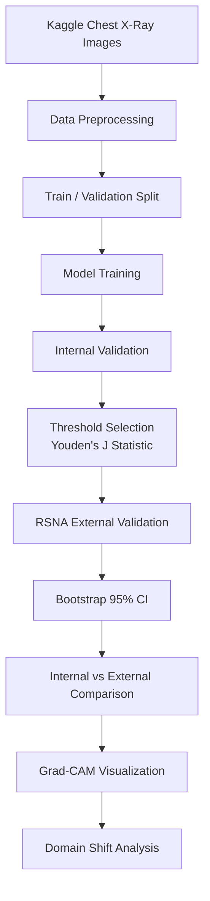

# 🫁 aip_project

<div align="center">

# Pneumonia Classification & Domain Shift Analysis

### Chest X-ray 기반 폐렴 분류 AI 모델 개발  
### Kaggle 내부 검증과 RSNA 외부 검증을 통한 Domain Shift 분석

<br>


<br>

> **내부 validation에서 잘 작동하는 폐렴 분류 모델은  
> 외부 데이터셋에서도 같은 수준으로 작동할까?**

</div>

---

## 📌 Project Summary

`aip_project`는 흉부 X-ray 이미지를 이용해 **정상(Normal)** 과 **폐렴(Pneumonia)** 을 분류하는 의료 AI 프로젝트입니다.

하지만 이 프로젝트의 핵심은 단순히 폐렴 분류 모델을 만드는 것이 아닙니다.  
진짜 목표는 **Kaggle 데이터셋에서 학습한 모델이 RSNA 외부 데이터셋에서도 안정적으로 작동하는지 검증하는 것**입니다.

의료 AI 모델은 내부 데이터셋에서 높은 성능을 보여도, 실제 다른 병원이나 다른 촬영 환경에서는 성능이 크게 떨어질 수 있습니다.  
본 프로젝트는 이러한 문제를 **Domain Shift** 관점에서 분석합니다.

---

## 🎯 Main Objective

본 프로젝트는 다음 질문에 답하는 것을 목표로 합니다.

```text
Kaggle Chest X-ray 데이터셋으로 학습한 폐렴 분류 모델이
RSNA Pneumonia Detection Challenge 데이터셋에서도
동일하게 신뢰할 수 있는 성능을 보이는가?
```

이를 위해 내부 validation 성능과 외부 validation 성능을 비교하고,  
성능 차이를 정량적으로 분석합니다.

---

## 🧠 Core Idea

<div align="center">

| 일반적인 폐렴 분류 프로젝트 | aip_project |
|---|---|
| 내부 validation accuracy 중심 | 내부 성능과 외부 성능 차이 비교 |
| 단일 데이터셋 성능 보고 | Kaggle → RSNA 외부 검증 |
| threshold를 데이터셋마다 조정 | 내부 threshold를 외부에 고정 적용 |
| 점수만 보고 종료 | Bootstrap CI와 Grad-CAM으로 분석 |
| 모델 성능 자체에 집중 | Domain Shift 발생 여부에 집중 |

</div>

---

## 🔬 Why Domain Shift?

의료 영상 데이터는 병원, 촬영 장비, 환자군, 라벨링 기준, 전처리 방식에 따라 분포가 달라질 수 있습니다.

따라서 하나의 데이터셋에서 높은 성능을 보인 모델이라도,  
다른 데이터셋에서는 성능이 크게 흔들릴 수 있습니다.

본 프로젝트에서는 다음 구조로 Domain Shift를 확인합니다.

```text
Train Dataset       : Kaggle Chest X-Ray Images
Internal Validation : Kaggle validation split
External Validation : RSNA Pneumonia Detection Challenge
```

핵심은 **RSNA 데이터셋을 학습에 사용하지 않는 것**입니다.  
RSNA는 오직 외부 검증 단계에서만 사용합니다.

---

## 🗂 Dataset

## 1. Kaggle Chest X-Ray Images

학습 및 내부 검증에 사용하는 데이터셋입니다.

| Item | Description |
|---|---|
| Dataset | Chest X-Ray Images (Pneumonia) |
| Source | Kaggle |
| Format | JPEG |
| Task | Normal vs Pneumonia binary classification |
| Usage | Training / Internal validation |

```text
Kaggle Chest X-Ray Images
├── NORMAL
└── PNEUMONIA
```

원본 validation set은 이미지 수가 매우 적기 때문에,  
본 프로젝트에서는 Kaggle train 데이터를 자체적으로 train / validation으로 다시 분할합니다.

---

## 2. RSNA Pneumonia Detection Challenge

외부 검증에 사용하는 데이터셋입니다.

| Item | Description |
|---|---|
| Dataset | RSNA Pneumonia Detection Challenge |
| Source | Kaggle Competition |
| Format | DICOM |
| Task | Pneumonia detection |
| Usage | External validation only |

```text
RSNA Pneumonia Detection Challenge
├── stage_2_train_images/
├── stage_2_train_labels.csv
└── stage_2_detailed_class_info.csv
```

RSNA 데이터셋은 모델 학습이나 threshold 튜닝에 사용하지 않습니다.  
외부 환경에서 모델이 얼마나 일반화되는지 확인하기 위한 검증 데이터로만 사용합니다.

---

## 🧭 Project Pipeline



---

## 🏗 Model Architecture

본 프로젝트는 단계적으로 모델을 확장합니다.

| Model | Purpose |
|---|---|
| Baseline CNN | 최소 기준 성능 확인 |
| ResNet50 | 전이학습 기반 성능 개선 |
| TorchXRayVision Model | 의료 영상 사전학습 모델 후보 |

초기 단계에서는 Baseline CNN으로 전체 파이프라인을 먼저 검증하고,  
이후 ResNet50 기반 전이학습 모델로 확장합니다.

---

## 📊 Evaluation Metrics

폐렴 분류 문제에서는 단순 Accuracy만으로 모델을 평가하기 어렵습니다.

특히 폐렴 환자를 정상으로 잘못 분류하는 **False Negative**를 줄이는 것이 중요하기 때문에,  
Recall, F1-score, AUC를 함께 확인합니다.

| Metric | Meaning |
|---|---|
| Accuracy | 전체 예측 중 맞춘 비율 |
| Precision | 폐렴으로 예측한 것 중 실제 폐렴 비율 |
| Recall | 실제 폐렴을 놓치지 않고 잡아낸 비율 |
| F1-score | Precision과 Recall의 균형 |
| AUC-ROC | threshold 변화에 따른 전체 분류 성능 |
| Bootstrap 95% CI | 성능 추정치의 신뢰구간 |

---

## 🎚 Threshold Policy

본 프로젝트에서는 외부 검증에서 threshold를 다시 최적화하지 않습니다.

내부 validation set에서 ROC curve를 만든 뒤,  
**Youden's J statistic**을 이용해 threshold를 결정합니다.

```text
Youden's J = Sensitivity + Specificity - 1
```

그 다음 이 threshold를 RSNA 외부 검증에 그대로 적용합니다.

```text
Internal Validation에서 threshold 결정
                  ↓
RSNA External Validation에 동일 threshold 적용
                  ↓
외부 데이터셋에서 성능 하락 여부 확인
```

이 방식은 외부 데이터셋에 맞춰 모델을 유리하게 조정하지 않기 때문에,  
Domain Shift를 더 공정하게 분석할 수 있습니다.

---

## 📈 Bootstrap Confidence Interval

단일 성능 점수만으로는 모델을 충분히 평가하기 어렵습니다.

따라서 본 프로젝트에서는 internal validation과 external validation 각각에 대해  
Bootstrap resampling을 수행하고 95% Confidence Interval을 계산합니다.

```text
Internal AUC  : point estimate + 95% CI
External AUC  : point estimate + 95% CI

Internal F1   : point estimate + 95% CI
External F1   : point estimate + 95% CI
```

이를 통해 내부 성능과 외부 성능의 차이가 단순한 우연인지,  
의미 있는 성능 저하인지 확인합니다.

---

## 🔥 Grad-CAM Analysis

Grad-CAM은 모델이 X-ray 이미지의 어느 영역을 보고 판단했는지 확인하기 위해 사용합니다.

본 프로젝트에서는 Grad-CAM을 단순 시각화가 아니라  
Domain Shift 해석 자료로 활용합니다.

확인할 내용은 다음과 같습니다.

- 모델이 실제 폐 영역을 보고 판단하는가
- 이미지 외곽, 텍스트, 병원 마커, 배경에 의존하는가
- Kaggle과 RSNA에서 주목 영역이 달라지는가
- False Negative 사례에서 모델이 어떤 부분을 놓치는가

---

## 🛠 Tech Stack

<div align="center">

| Category | Stack |
|---|---|
| Language | Python |
| Deep Learning | PyTorch |
| Model Library | timm |
| Image Processing | OpenCV, PIL |
| Medical Image Processing | pydicom |
| Data Analysis | pandas, numpy |
| Evaluation | scikit-learn |
| Visualization | matplotlib, Grad-CAM |
| Experiment Environment | KHU SERAPH GPU Cluster |
| Scheduler | Slurm, sbatch |
| Version Control | Git, GitHub |

</div>

---

## 📁 Repository Structure

```text
aip_project/
├── README.md
├── .gitignore
├── docs/
│   └── proposal.md
├── src/
│   ├── dataset.py
│   ├── prepare_kaggle_split.py
│   ├── train_baseline.py
│   ├── evaluate_baseline_external.py
│   ├── rsna_dataset.py
│   └── models/
│       └── baseline_cnn.py
├── scripts/
│   └── *.sbatch
└── outputs/
    ├── splits/
    ├── baseline/
    ├── reports/
    └── figures/
```

> `outputs/`, dataset files, model checkpoints are not committed to GitHub.

---

## 🖥 Experiment Environment

본 프로젝트는 KHU SERAPH GPU Cluster의 moana 클러스터에서 실행합니다.

SERAPH에서는 마스터 노드에서 무거운 작업을 실행하지 않고,  
`srun` 또는 `sbatch`를 통해 컴퓨트 노드에서 학습과 평가를 수행합니다.

```text
Dataset archive path
/data/$USER/datasets/tarfiles

Training dataset path
/local_datasets/$USER
```

DataLoader는 `/data`를 직접 읽지 않고,  
컴퓨트 노드의 `/local_datasets/$USER` 경로를 기준으로 데이터를 로드합니다.

---

## 🚀 How to Run

## 1. Prepare Kaggle Split

```bash
python src/prepare_kaggle_split.py \
  --data_root /local_datasets/$USER/chest_xray_kaggle/chest_xray \
  --output_csv outputs/splits/kaggle_split_seed42.csv \
  --seed 42
```

---

## 2. Train Baseline CNN

```bash
python src/train_baseline.py \
  --split_csv outputs/splits/kaggle_split_seed42.csv \
  --data_root /local_datasets/$USER/chest_xray_kaggle/chest_xray \
  --output_dir outputs/baseline \
  --seed 42 \
  --epochs 5
```

---

## 3. External Validation on RSNA

```bash
python src/evaluate_baseline_external.py \
  --checkpoint outputs/baseline/best_baseline_seed42.pt \
  --split_csv outputs/splits/kaggle_split_seed42.csv \
  --rsna_root /local_datasets/$USER/rsna \
  --output_dir outputs/baseline_external \
  --sample_per_class 1000 \
  --seed 42
```

---

## 📌 Current Progress

현재까지 구현 및 검증된 내용입니다.

- Kaggle Chest X-Ray Images 데이터셋 다운로드 완료
- RSNA Pneumonia Detection Challenge 데이터셋 다운로드 완료
- SERAPH 컴퓨트 노드에서 데이터셋 압축 해제 완료
- Kaggle train 데이터 기반 train / validation split 생성
- Baseline CNN 학습 코드 구현
- Baseline CNN 내부 validation 실행
- RSNA external validation 코드 구현
- 내부 validation threshold를 RSNA 외부 검증에 고정 적용
- Kaggle internal validation과 RSNA external validation 성능 차이 확인

---

## 🧪 Preliminary Result

초기 Baseline CNN 실험에서 Kaggle 내부 validation과 RSNA 외부 validation 사이에 큰 성능 차이가 확인되었습니다.

```text
Kaggle Internal Validation
AUC ≈ 0.96

RSNA External Validation
AUC ≈ 0.64
```

이는 모델이 Kaggle 데이터셋 내부에서는 높은 성능을 보였지만,  
외부 데이터셋인 RSNA에서는 성능이 크게 하락했음을 의미합니다.

즉, Baseline 단계에서도 Domain Shift 현상이 관찰되었습니다.

---

## ✅ To-Do

- [x] Kaggle dataset download
- [x] RSNA dataset download
- [x] Kaggle train / validation split
- [x] Baseline CNN training
- [x] RSNA external validation
- [ ] ResNet50 transfer learning
- [ ] 3 random seed experiments
- [ ] Bootstrap 95% Confidence Interval
- [ ] Grad-CAM visualization
- [ ] Final domain shift analysis report

---

## 🧩 Expected Outputs

| Output | Description |
|---|---|
| Split CSV | Kaggle train / validation split 정보 |
| Model Checkpoint | 학습된 모델 가중치 |
| Internal Report | Kaggle validation 성능 결과 |
| External Report | RSNA validation 성능 결과 |
| Bootstrap Report | AUC, F1-score의 95% CI |
| Grad-CAM Figures | 모델 판단 근거 시각화 |
| Domain Shift Report | 내부/외부 성능 차이 분석 |

---

## ⚠️ Notes

본 프로젝트는 의료 진단을 직접 대체하기 위한 목적이 아닙니다.

이 프로젝트는 공개 데이터셋 기반의 의료 영상 분류 모델을 구현하고,  
외부 검증을 통해 의료 AI 모델의 일반화 성능과 Domain Shift 문제를 분석하기 위한 연구 및 교육 목적의 프로젝트입니다.

---

## ⭐ Key Message

<div align="center">

### This project is not only about building a pneumonia classifier.

<br>

### It is about asking whether a model that performs well internally  
### can still be trusted under an external data distribution.

<br>

### Kaggle → RSNA  
### Internal Validation → External Validation  
### Performance Score → Domain Shift Analysis

</div>
